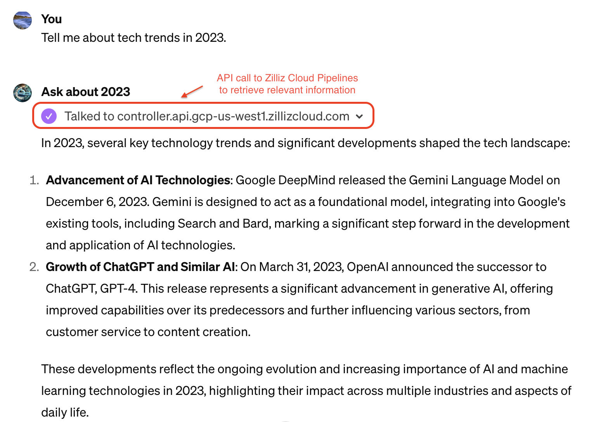
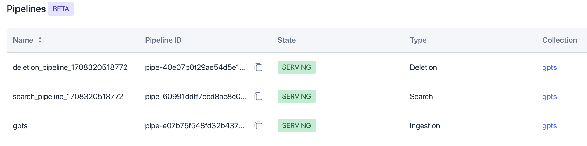
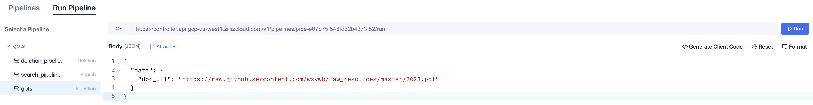
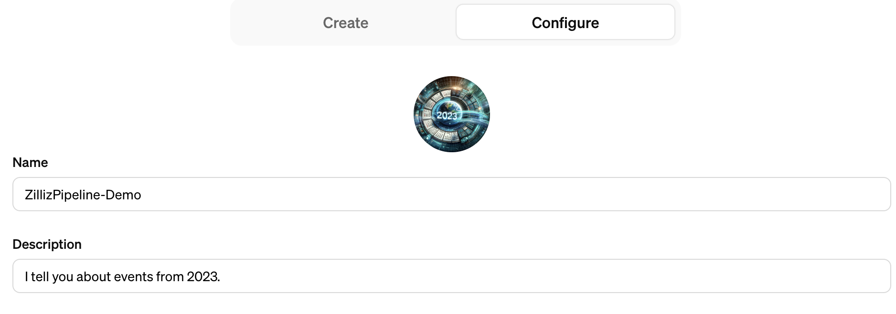
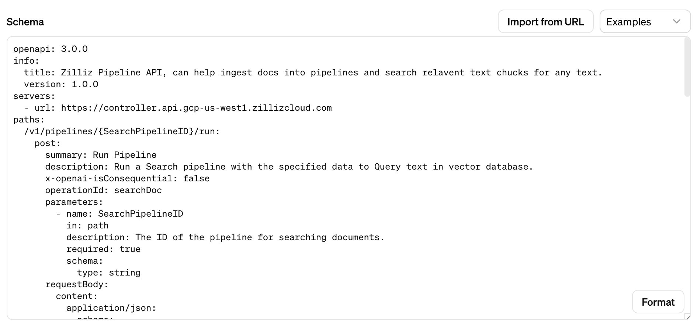
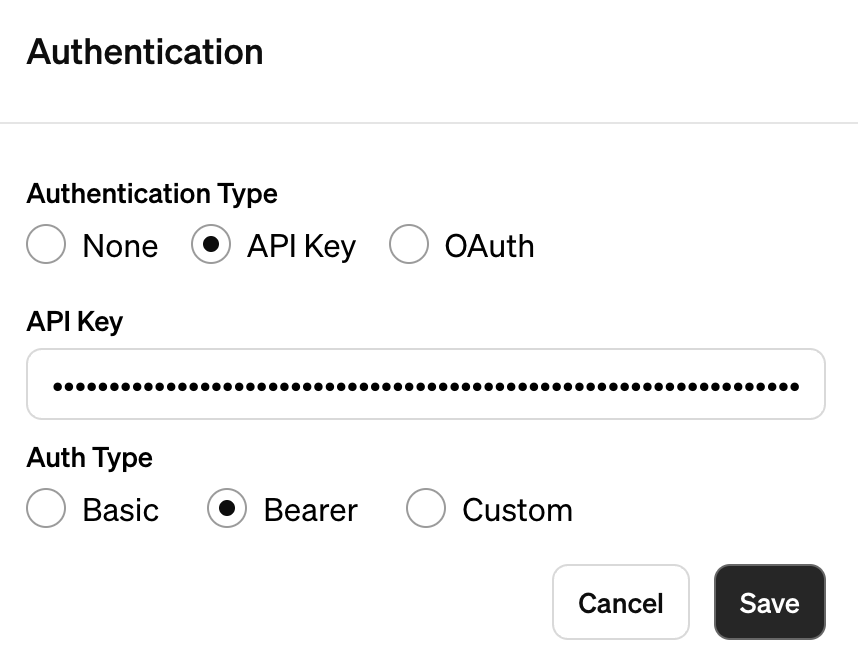
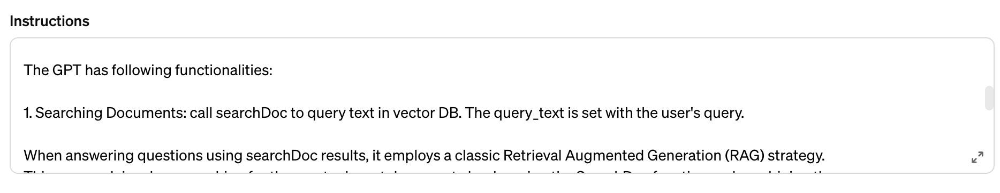
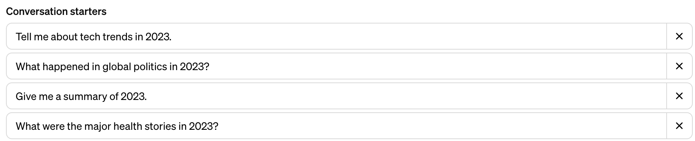
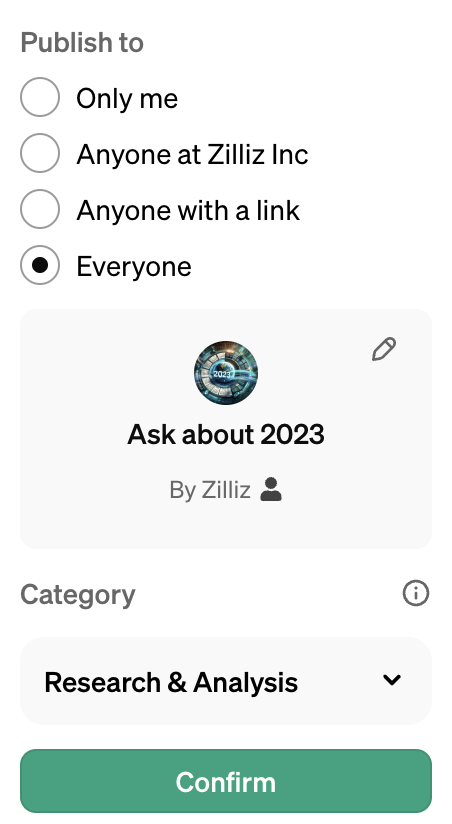
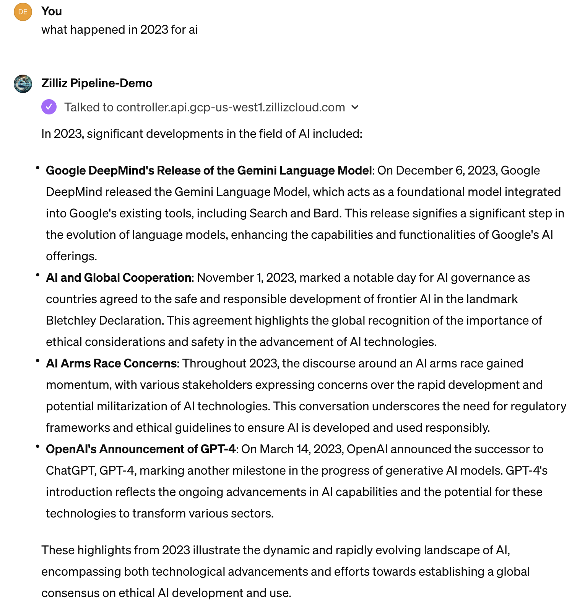

# Retriever-for-GPTs

This repo contains instructions and templates to plug-in external retriever service for **[GPTs](https://openai.com/blog/introducing-gpts)**, powered by Zilliz Cloud Pipelines.

**[Zilliz Cloud Pipelines](https://zilliz.com/zilliz-cloud-pipelines)**  is a one-stop retrieval service. By configuring this external retrieval service as a GPTs "Action", this approach provides a more flexible and economic alternative to the default GPTs knowledge base.

- try a live demo here: https://chat.openai.com/g/g-CXDhOVcGf-ask-about-2023 (ChatGPT Plus Subscription required to use GPTs)

   

Zilliz Cloud Pipelines is DevOps free, highly scalable and economic. Compared to the default GPTs retrieval capability that only accepts uploaded files, this service supports rich customizations such as multiple chunking strategy, choices of embedding models from BAAI, Voyage AI and OpenAI, and optional reranking capability (coming soon in early March).

In GPTs, the integration with Zilliz Cloud Pipelines can be simply done by copying the API config and prompt from this repo.

# Quick Start
**This tutorial shows how to use Zilliz Cloud Pipelines to build your own GPTs with retrieval capability.**

In this quick start guide, we built a demo GPTs **Ask about 2023** that can answer questions about events that occurred in 2023. ChatGPT doesn't have information of 2023, so a correct answer would depend on retrieving relevant information from external knowledge base, in this case implemented with Zilliz Cloud Pipelines.

## Step 1. Set up a knowledge base on Zilliz Cloud
1. Sign up on [Zilliz Cloud](https://cloud.zilliz.com/signup?utm_source=partner&utm_medium=referral&utm_campaign=2024-01-18_product_zcp-demos_github&utm_content=history-rag) to get an account or use an existing Zilliz Cloud account.
2. Create pipelines by following the [instructions](https://docs.zilliz.com/docs/understanding-pipelines). These pipelines can ingest/search/delete knowledges on vector database. After creating the ingestion, search and deletion pipelines. Note down the **search pipeline ID**: `pipe-xxxxxxxxxxxx` and your **API-Key**. They will be used to set up Action on GPTs.

   

3. Index the knowledge documents by running ingest pipeline: Navigate to the Pipeline Playground, enter the `doc_url` field, and click Run to ingest the document.

   - for example, for the demo GPTs **Ask about 2023**, we ingest a PDF file that contains the events of 2023. To ingest your own knowledge file, [here](https://docs.zilliz.com/docs/run-ingestion-pipelines) is detailed instruction.
    ```markdown
    "doc_url": "https://raw.githubusercontent.com/wxywb/raw_resources/master/2023.pdf"
    ```
    

## Step 2. Create GPTs
1. Visit https://chat.openai.com/gpts/editor to create a new GPTs.
2. Fill in the GPT name and its description. For example, Ask about 2023.
3. Optionally, upload a photo for the GPT.



## Step 3. Add GPT Action
1. Click **Create new action** to set up a new action.

   

2. Insert the content from the YAML file [rag.yaml](openapi%2Frag.yaml) into the GPT action Schema field.
3. Substitute SearchPipelineID with your previously noted search pipeline ID: `pipe-xxxxxxxxxxxx`.
   
4. Configure authentication to allow GPTs to call Zilliz Cloud API:
  - Click Authentication.
  - Choose API-key as the Authentication Type and Bearer as the Auth Type.
  - Enter the API-Key obtained from your Zilliz Cloud account.
    
      

5. Fill in the default Privacy Policy URL: `https://openai.com/policies/terms-of-use`

## Step 4. Configure GPTs Instructions
GPTs require instructions to guide their behavior, so that during chat they can properly use the above defined action to retrieve relevant knowledge. The instructions should be clear and concise, providing a comprehensive understanding of the GPT's capabilities and limitations.

The instructions should include **2 parts**, the first part is the general instructions for the GPTs, and the second part is the prompt for using action as retrieval tool.
1. In the Configure tab, input instruction **Part 1**. This is specific to your application, explaining what this GPT is supposed to do.
   - For example, for **Ask about 2023**, the instruction **Part 1** is as follows:
   ```markdown
   This GPT is designed to inform users about events that occurred in 2023. It provides summaries, insights, and detailed
   accounts of significant happenings from that year. It aims to be informative, engaging, and accurate in its
   descriptions, ensuring users receive a comprehensive understanding of the year's events. When asked, it will focus on
   delivering concise information about specific incidents, trends, developments in various fields such as technology,
   global politics, health, and culture. It will avoid speculation and stick to verified information to maintain
   credibility.
   
   In cases where details are not clear or are disputed, the GPT may clarify that the information is based on available
   sources as of its last training cut-off in April 2023. It will encourage users to consult up-to-date sources for the
   latest information. The GPT is friendly and approachable in its tone, making historical information accessible and
   interesting to a wide audience. It avoids sensitive topics with respect and care, ensuring that discussions are handled
   with empathy and awareness of their complexity.
   ```

2. Copy the instruction **Part 2** from [rag_prompt.md](prompt%2Frag_prompt.md) and append it to the above instruction. This is to instruct the GPT how to trigger the action to retrieve external knowledge by calling RESTful API of Zilliz Cloud Pipelines.
  
   

Optionally, you can add conversation starters to guide users on how what to ask with your GPT.

   

## Step 5. Publish Your GPTs
1. Click Save to make your GPT accessible to users.

   

## Step 6. Chat with Your GPTs
1. Now you can try the newly created GPT with Zilliz Cloud Pipelines as external knowledge base. In the GPTs page, select the GPT you've created, and start asking questions. The answer will be based on the 2023 events stored on Zilliz Cloud Pipelines.

   

### Support

If you have questions in using Zilliz Cloud Pipelines with GPTs, please feel free to open an issue in this repo or reach out to our support team: Email: support@zilliz.com

# Appendix
- [Introducing Zilliz Cloud Pipelines: A One-Stop Service for Building AI-Powered Search](https://zilliz.com/blog/introducing-zilliz-cloud-pipelines-one-stop-service-building-ai-powered-search)
- [Introducing GPTs](https://openai.com/blog/introducing-gpts)
- [rag.yaml](openapi%2Frag.yaml)
- [rag.md](prompt%2Frag.md)
- [2023.pdf](https://raw.githubusercontent.com/wxywb/raw_resources/master/2023.pdf)
- [Zilliz Cloud](https://www.zilliz.com)
- [OpenAI](https://openai.com)